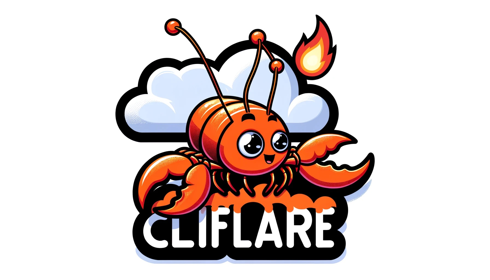

# 

[](<https://github.com/davepmiller/cliflare/actions/workflows/ci.yml>)
[](<https://github.com/davepmiller/cliflare/actions/workflows/publish.yml>)
[](https://coveralls.io/github/davepmiller/cliflare)
[](<https://crates.io/crates/cliflare>)
[](<https://crates.io/crates/cliflare>)
[](<https://opensource.org/licenses/MIT>)

* 🛠 CLI️ to interact with Cloudflare APIs
* 🥳 An excuse to write some Rust
* 👷 Under heavy development

## Setup

### [Install Rust 📝](https://www.rust-lang.org/tools/install)

```bash
curl --proto '=https' --tlsv1.2 -sSf https://sh.rustup.rs | sh
```

### Install

```bash
cargo install cliflare
```

### [Generate a Cloudflare API token 📝](https://developers.cloudflare.com/cloudflare-one/api-terraform/scoped-api-tokens/)

### [Grab Account And Zone IDs 📝](https://developers.cloudflare.com/fundamentals/setup/find-account-and-zone-ids/)

### Environment

```bash
# add your token value to a startup script
echo CLOUDFLARE_ENDPOINT=https://api.cloudflare.com/client/v4 >> ~/.zshrc
echo CLOUDFLARE_TOKEN=abcd1234**API_TOKEN**4321dcba >> ~/.zshrc
echo CLOUDFLARE_ACCOUNT_ID=abcd1234**ACCOUNT_ID**4321dcba >> ~/.zshrc
```

## Examples

### [Token Verify 📝](https://developers.cloudflare.com/api/operations/user-api-tokens-verify-token)

```bash
cliflare token verify
```

### [Zone List 📝](https://developers.cloudflare.com/api/operations/zones-get)

```bash
# print out all zone info
cliflare zone list
# print only zone "name" field -- i.e. domains
cliflare zone list --domains
```

### [Create a Zone 📝](https://developers.cloudflare.com/api/operations/zones-post)

```bash
cliflare zone create newzone.com
```

### [Delete a Zone 📝](https://developers.cloudflare.com/api/operations/zones-0-delete)

```bash
cliflare zone delete newzone.com
```

### [List DNS Records For A Zone 📝](https://developers.cloudflare.com/api/operations/dns-records-for-a-zone-list-dns-records)

```bash
cliflare dns list --zone_id <ZONE_ID>
cliflare dns list --zone_name <DOMAIN>
```

### [Export DNS Records For A Zone 📝](https://developers.cloudflare.com/api/operations/dns-records-for-a-zone-export-dns-records)

```bash
cliflare dns export --zone_id <ZONE_ID>
cliflare dns export --zone_name <DOMAIN>
```

### [Import DNS Records For A Zone 📝](https://developers.cloudflare.com/api/operations/dns-records-for-a-zone-import-dns-records)

```bash
cliflare dns import --file <PATH> --zone_id <ZONE_ID>
cliflare dns import -file <PATH> --zone_name <DOMAIN>
```

### [Delete All DNS Records For A Zone 📝](https://developers.cloudflare.com/api/operations/dns-records-for-a-zone-delete-dns-record)

```bash
cliflare dns clear --zone_id <ZONE_ID>
cliflare dns clear --zone_name <DOMAIN>
```

### [List All Settings For A Zone 📝](https://developers.cloudflare.com/api/operations/zone-settings-get-all-zone-settings)

```bash
cliflare settings list --zone_id <ZONE_ID>
cliflare settings list --zone_name <DOMAIN>
```

## License

Cliflare is free software.
This project is available under the terms of
either the Apache 2.0 license or the MIT license.
Cliflare is provided on an "AS IS" basis and there is NO WARRANTY attached to it.

## Feature Requests

Fill out [this form](https://docs.google.com/forms/d/e/1FAIpQLSfDBhmvtRn1C3Vzi_nplHV9QyBVbPUfdqhziUj_sWYyi-XIFw/viewform?usp=sf_link)
and I'll get back to you.
